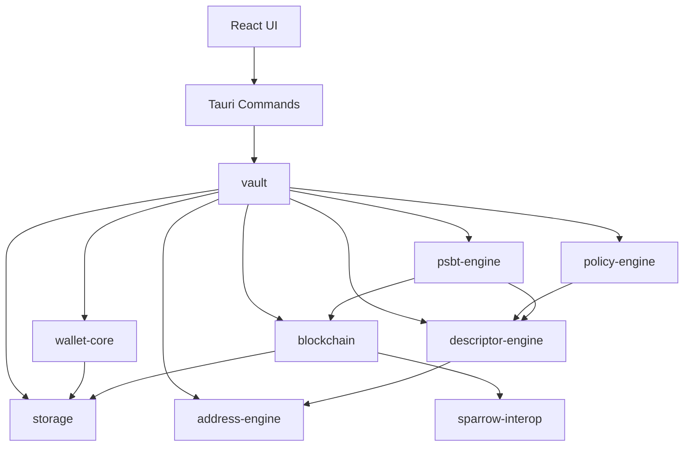
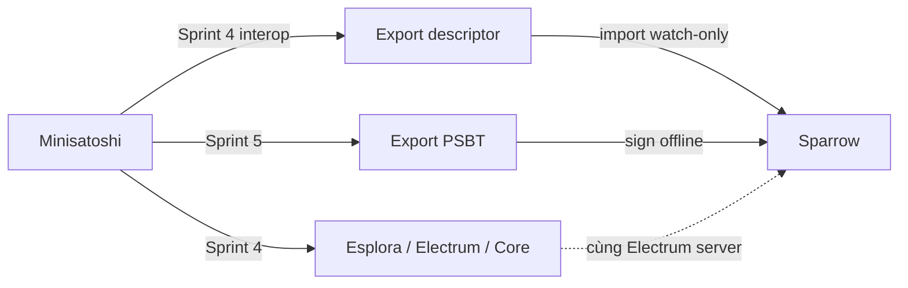
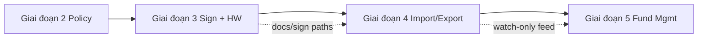

# Kế hoạch phát triển Minisatoshi — Bitcoin Vault Engine

> Ứng dụng desktop offline-first, mã nguồn mở, tập trung vào một việc: **tạo và quản lý Bitcoin vault bằng Miniscript**.
> Không server, không cloud, không tài khoản. Fund management (Giai đoạn 5) chỉ xuất hiện khi MVP ổn định.

---

## Mục lục

1. [Nguyên tắc kiến trúc](#nguyên-tắc-kiến-trúc)
2. [Tech stack](#tech-stack)
3. [Cấu trúc monorepo](#cấu-trúc-monorepo)
4. [Sơ đồ phụ thuộc module](#sơ-đồ-phụ-thuộc-module)
5. [Policy Engine tổng quát](#policy-engine-tổng-quát)
6. [Giai đoạn 1 — MVP (8 Sprint)](#giai-đoạn-1--mvp-8-sprint)
7. [Giai đoạn 2–5](#giai-đoạn-25-roadmap) — chi tiết Sprint 9–19 (ký/HW, import/export, fund mgmt)
8. [Quyết định kỹ thuật](#quyết-định-kỹ-thuật)
9. [Test strategy](#test-strategy)
10. [Rủi ro và giảm thiểu](#rủi-ro-và-giảm-thiểu)

---


## Nguyên tắc kiến trúc


| Nguyên tắc                        | Ý nghĩa                                                                          |
| --------------------------------- | -------------------------------------------------------------------------------- |
| **Rust-first**                    | Mọi logic Bitcoin/Miniscript nằm trong crates Rust                               |
| **UI không biết Miniscript**      | React chỉ gửi policy JSON + xpub; engine compile descriptor                      |
| **Policy engine tổng quát**       | Không hard-code A/B/C; mọi vault là một policy config                            |
| **Offline by default**            | Blockchain sync là tùy chọn, không bắt buộc để tạo vault                         |
| **Descriptor là source of truth** | Vault = descriptor + metadata; có thể export/import                              |
| **Tương thích ví bên ngoài**      | Sparrow không phải backend; interop qua descriptor + PSBT + cùng Electrum server |


---


## Tech stack

```text
Rust
Tauri 2
React
TypeScript
rust-bitcoin
rust-miniscript
bdk_wallet
bitcoincore-rpc
serde
SQLite
```

---


## Cấu trúc monorepo

```text
minisatoshi/
├── Cargo.toml                    # workspace root
├── apps/
│   └── desktop/                  # Tauri 2 app
│       ├── src-tauri/
│       └── src/                  # React + TypeScript
├── crates/
│   ├── wallet-core/              # wallet lifecycle
│   ├── policy-engine/            # JSON policy → Miniscript
│   ├── descriptor-engine/        # Miniscript → descriptor
│   ├── address-engine/           # derive receive/change
│   ├── psbt-engine/              # create/sign/combine/finalize
│   ├── blockchain/               # Esplora / Electrum / Core + Sparrow interop
│   ├── storage/                  # SQLite
│   └── vault/                    # orchestration layer
├── ui/                           # shared React components (optional)
├── tests/
│   ├── integration/
│   └── vectors/                  # known-good descriptors, PSBTs
└── docs/
    └── DEVELOPMENT_PLAN.md       # file này
```

**Thứ tự build bắt buộc:**

`storage` → `policy-engine` → `descriptor-engine` → `wallet-core` → `address-engine` → `blockchain` → `psbt-engine` → `vault` → `desktop UI`

---


## Sơ đồ phụ thuộc module




---


## Policy Engine tổng quát

Thay vì thiết kế riêng cho mô hình A/B/C, policy engine nhận cấu hình tổng quát. UI wizard A/B/C chỉ là **preset** map sang policy JSON.

### Schema policy (v1)

```json
{
  "version": 1,
  "network": "mainnet",
  "script_type": "taproot",
  "keys": [
    { "id": "A", "role": "investor", "xpub": "xpub6...", "fingerprint": "a1b2c3d4" },
    { "id": "B", "role": "manager",  "xpub": "xpub6...", "fingerprint": "e5f6g7h8" },
    { "id": "C", "role": "recovery", "xpub": "xpub6...", "fingerprint": "i9j0k1l2" }
  ],
  "policy": {
    "primary": "(A && B) || (A && C)",
    "fallback": {
      "after": "4y",
      "allow": "A"
    }
  }
}
```


### Pipeline biên dịch

```text
PolicyConfig (JSON)
    ↓ validate schema
Policy AST (internal)
    ↓ resolve keys → pk(K) fragments
Miniscript expression
    ↓ compile (rust-miniscript)
Descriptor (tr(...) hoặc wsh(...))
    ↓ checksum
Output descriptor string
```


### Policy DSL nội bộ


| Token            | Miniscript                             |
| ---------------- | -------------------------------------- |
| `A`, `B`, `C`    | `pk(key_A)`                            |
| `&&`             | `and_v` / `andor` (tùy context)        |
| `||`             | `or_i` / `or_c`                        |
| `after: 4y`      | `older(126144)` (blocks, configurable) |
| `thresh(k, ...)` | `thresh(k, ...)`                       |


### Preset templates (UI wizard)

UI wizard A/B/C map sang:

```json
{
  "primary": "(A && B) || (A && C)",
  "fallback": { "after": "4y", "allow": "A" }
}
```

Sau này thêm preset `2-of-3`, `3-of-5` mà không sửa engine.

---


## Giai đoạn 1 — MVP (8 Sprint)

Mỗi sprint = 1–2 session Cursor, có deliverable test được.

---


### Sprint 0 — Scaffold

**Mục tiêu:** Monorepo chạy được, CI cơ bản.

- [ ] Khởi tạo Cargo workspace
- [ ] Tauri 2 + React + TypeScript + Vite
- [ ] `rustfmt`, `clippy`, GitHub Actions (build + test)
- [ ] README cơ bản

**Deliverable:** `cargo test` pass, app mở được window trống.

---


### Sprint 1 — `policy-engine` + `descriptor-engine`

**Mục tiêu:** JSON → descriptor string, có unit test.

#### `policy-engine` API

```rust
pub struct PolicyConfig { /* serde */ }
pub fn validate(config: &PolicyConfig) -> Result<(), PolicyError>;
pub fn compile_miniscript(config: &PolicyConfig) -> Result<Miniscript<...>, PolicyError>;
```


#### `descriptor-engine` API

```rust
pub fn compile_descriptor(
    miniscript: Miniscript<...>,
    network: Network,
    script_type: ScriptType,  // Taproot default
) -> Result<String, DescriptorError>;

pub fn parse_descriptor(desc: &str) -> Result<Descriptor, DescriptorError>;
pub fn checksum(descriptor: &str) -> String;
```


#### Tests bắt buộc

- A/B/C preset → descriptor khớp vector đã biết
- `2-of-3` preset
- Timelock `4y` → `older(N)` đúng
- Invalid policy → error rõ ràng

**Deliverable:** `cargo test -p policy-engine` + `cargo test -p descriptor-engine` green.

---


### Sprint 2 — `storage` + `wallet-core`


#### SQLite schema v1

```sql
-- wallets
CREATE TABLE wallets (
    id          TEXT PRIMARY KEY,
    name        TEXT NOT NULL,
    network     TEXT NOT NULL,       -- mainnet | testnet | signet
    created_at  INTEGER NOT NULL,
    updated_at  INTEGER NOT NULL
);

-- vaults (1 wallet → nhiều vault)
CREATE TABLE vaults (
    id            TEXT PRIMARY KEY,
    wallet_id     TEXT NOT NULL REFERENCES wallets(id),
    name          TEXT NOT NULL,
    policy_json   TEXT NOT NULL,     -- PolicyConfig serialized
    descriptor    TEXT NOT NULL,
    script_type   TEXT NOT NULL,
    created_at    INTEGER NOT NULL
);

-- addresses
CREATE TABLE addresses (
    id          TEXT PRIMARY KEY,
    vault_id    TEXT NOT NULL REFERENCES vaults(id),
    address     TEXT NOT NULL,
    index       INTEGER NOT NULL,
    is_change   BOOLEAN NOT NULL,
    used        BOOLEAN DEFAULT FALSE,
    created_at  INTEGER NOT NULL
);

-- transactions (watch-only)
CREATE TABLE transactions (
    txid        TEXT NOT NULL,
    vault_id    TEXT NOT NULL REFERENCES vaults(id),
    block_height INTEGER,
    amount      INTEGER,             -- satoshis, signed
    fee         INTEGER,
    confirmed   BOOLEAN,
    raw_json    TEXT,                -- full tx metadata
    PRIMARY KEY (txid, vault_id)
);

-- labels
CREATE TABLE labels (
    id          TEXT PRIMARY KEY,
    target_type TEXT NOT NULL,       -- address | tx | vault
    target_id   TEXT NOT NULL,
    label       TEXT NOT NULL
);
```


#### `wallet-core` API

```rust
pub fn create_wallet(name: &str, network: Network) -> Result<Wallet, WalletError>;
pub fn open_wallet(id: &str) -> Result<Wallet, WalletError>;
pub fn list_wallets() -> Result<Vec<WalletSummary>, WalletError>;
pub fn backup_wallet(id: &str, path: &Path) -> Result<(), WalletError>;
pub fn restore_wallet(path: &Path) -> Result<Wallet, WalletError>;
pub fn import_descriptor(wallet_id: &str, descriptor: &str) -> Result<Vault, WalletError>;
pub fn export_descriptor(vault_id: &str) -> Result<String, WalletError>;
```

**Deliverable:** Tạo wallet, lưu/load từ SQLite, round-trip descriptor.

---


### Sprint 3 — `address-engine` + `vault`


#### `address-engine` API

```rust
pub fn new_receive_address(vault: &Vault, index: u32) -> Result<Address, AddressError>;
pub fn new_change_address(vault: &Vault, index: u32) -> Result<Address, AddressError>;
pub fn derive_address(descriptor: &str, index: u32, is_change: bool) -> Result<String, AddressError>;
```


#### `vault` API

```rust
pub fn create_vault(wallet_id: &str, name: &str, policy: PolicyConfig) -> Result<Vault, VaultError>;
pub fn list_vaults(wallet_id: &str) -> Result<Vec<VaultSummary>, VaultError>;
pub fn get_vault(vault_id: &str) -> Result<Vault, VaultError>;
pub fn vault_balance(vault_id: &str) -> Result<Balance, VaultError>;
pub fn vault_history(vault_id: &str) -> Result<Vec<TxSummary>, VaultError>;
```

**Deliverable:** Tạo vault từ policy JSON → nhận address Taproot đầu tiên. ✅

---


### Sprint 4 — `blockchain` + Sparrow interop


#### Trait chung

```rust
pub trait BlockchainBackend: Send + Sync {
    fn sync(&self, descriptor: &str, progress: impl Fn(SyncProgress)) -> Result<SyncResult, ChainError>;
    fn get_balance(&self, descriptor: &str) -> Result<Balance, ChainError>;
    fn get_history(&self, descriptor: &str) -> Result<Vec<TxSummary>, ChainError>;
    fn get_utxos(&self, descriptor: &str) -> Result<Vec<Utxo>, ChainError>;
    fn broadcast(&self, tx_hex: &str) -> Result<Txid, ChainError>;
}
```


#### Blockchain backends (theo thứ tự ưu tiên)

1. **Esplora** — dễ nhất, không cần node local
2. **Electrum** — phổ biến; **dùng chung server với Sparrow**
3. **Bitcoin Core RPC** — cho user chạy full node

> **Lưu ý:** Sparrow **không** implement `BlockchainBackend`. Sparrow là app ví desktop;
> nó kết nối *tới* Esplora/Electrum/Core chứ không expose API cho app khác query balance/UTXO.


#### Sparrow interop (`blockchain::sparrow`)

Module nhẹ, không phụ thuộc cài đặt Sparrow. Mục tiêu: workflow handoff file/string, offline-first.

```rust
/// Descriptor + metadata để user import watch-only wallet trong Sparrow.
pub struct SparrowWalletExport {
    pub name: String,
    pub descriptor: String,
    pub network: NetworkName,
    pub import_instructions: String,
}

pub fn export_watch_only_wallet(vault: &Vault) -> Result<SparrowWalletExport, SparrowError>;

/// Preset Electrum/Esplora URLs khớp network — cùng server Sparrow thường dùng.
pub fn default_server_presets(network: NetworkName) -> Vec<ServerPreset>;

pub struct ServerPreset {
    pub label: String,       // e.g. "Blockstream (SSL)"
    pub backend: BackendKind, // Esplora | Electrum | Core
    pub url: String,
}
```

**Sparrow ↔ Minisatoshi mapping**


| Tính năng         | Minisatoshi                                             | Sparrow                                 |
| ----------------- | ------------------------------------------------------- | --------------------------------------- |
| Sync balance/UTXO | `EsploraBackend` / `ElectrumBackend` / `CoreRpcBackend` | Cùng loại server, cùng network          |
| Watch-only vault  | Export descriptor từ vault                              | File → New Wallet → Import → Descriptor |
| Ký giao dịch      | Export PSBT unsigned (Sprint 5)                         | File → Open Transaction → Sign          |
| Broadcast         | `BlockchainBackend::broadcast`                          | Sparrow broadcast qua server của nó     |





#### Tests bắt buộc

- Esplora balance/history trên testnet/signet (mock HTTP hoặc integration nhẹ)
- Electrum client parse + query (mock server)
- `export_watch_only_wallet` → descriptor có checksum, đúng network
- `default_server_presets` trả preset hợp lệ cho từng network

**Deliverable:** Sync balance trên testnet/signet; export descriptor import được vào Sparrow watch-only. ✅

---


### Sprint 5 — `psbt-engine`


#### API

```rust
pub fn create_psbt(
    vault: &Vault,
    recipients: Vec<(Address, Amount)>,
    fee_rate: FeeRate,
    utxos: Vec<Utxo>,
) -> Result<Psbt, PsbtError>;

pub fn sign_psbt(psbt: &mut Psbt, signer: &dyn Signer) -> Result<SignProgress, PsbtError>;
pub fn combine_psbt(a: Psbt, b: Psbt) -> Result<Psbt, PsbtError>;
pub fn finalize(psbt: &mut Psbt) -> Result<Transaction, PsbtError>;
pub fn broadcast(psbt: &Psbt, backend: &dyn BlockchainBackend) -> Result<Txid, PsbtError>;
pub fn export_psbt(psbt: &Psbt, format: ExportFormat) -> Result<Vec<u8>, PsbtError>;
// ExportFormat: Base64 | File | QR-chunks
// Sparrow: import file .psbt hoặc paste base64 (BIP174 chuẩn, không custom format)
```

**Giai đoạn 1:** Sign bằng xprv/software key (dev/test). Ký qua Sparrow/hardware wallet → import PSBT đã ký. Hardware wallet trực tiếp → Giai đoạn 3.

#### Tests

- 2-of-2 PSBT create → sign → combine → finalize
- Timelock path: verify `nSequence` đúng
- PSBT export → Sparrow import round-trip (unsigned)

**Deliverable:** Tạo PSBT unsigned, export base64/file tương thích Sparrow; finalize với test keys. ✅

---


### Sprint 6 — Tauri commands + type bridge


#### Tauri commands (Rust → React)

```rust
#[tauri::command]
async fn create_vault_cmd(wallet_id: String, policy: PolicyConfig) -> Result<VaultDto, String>;

#[tauri::command]
async fn get_balance_cmd(vault_id: String) -> Result<BalanceDto, String>;

#[tauri::command]
async fn create_psbt_cmd(req: CreatePsbtRequest) -> Result<PsbtDto, String>;
```

**TypeScript types** generate từ `ts-rs` hoặc `specta` để đồng bộ Rust ↔ TS.

**Deliverable:** React gọi được `create_vault` qua Tauri IPC. ✅

---


### Sprint 7 — UI MVP


#### Pages


| Route                 | Nội dung                                                            |
| --------------------- | ------------------------------------------------------------------- |
| `/wallets`            | Danh sách wallet, tạo mới                                           |
| `/vaults`             | Danh sách vault, dashboard                                          |
| `/vaults/new`         | Wizard 5 bước                                                       |
| `/vaults/:id`         | Dashboard: balance, UTXO, policy, descriptor                        |
| `/vaults/:id/receive` | Address + QR + copy descriptor + **Export for Sparrow**             |
| `/vaults/:id/send`    | Wizard: address → amount → fee → PSBT export (Sparrow-compatible)   |
| `/settings`           | Network, blockchain backend, server URL, **Sparrow server presets** |


#### Sidebar

```text
Wallets
Vaults
Transactions
Settings
```


#### Create Vault Wizard

```text
Step 1: Investor XPUB  → validate fingerprint
Step 2: Manager XPUB
Step 3: Recovery XPUB
Step 4: Timelock (slider: 1–10 năm)
Step 5: Review policy JSON + Generate
```


#### Dashboard

Hiển thị: Balance, Recent TX, UTXO, Policy, Descriptor

#### Send flow

```text
Address → Amount → Fee → Create PSBT → Export (file / base64 → Sparrow)
```

**Deliverable:** End-to-end flow trên testnet: tạo vault → nhận address → tạo PSBT. ✅

---


### Sprint 8 — Test, hardening, release v0.1.0

- [x] Integration tests full flow (`crates/vault/tests/vault_lifecycle.rs`)
- [x] Test vectors cho Taproot descriptors (`tests/vectors/`)
- [x] Error messages thân thiện (không leak xprv) — `user_facing_error` + redact
- [x] App icon, version, release build (Windows + macOS + Linux) — branded icons + `release.yml`
- [x] `CHANGELOG.md`, `docs/policy-format.md`

**Deliverable:** Release v0.1.0 tooling sẵn sàng (tag `v0.1.0` → GitHub Release draft). ✅

---


## Giai đoạn 2–5 (roadmap)


### Giai đoạn 2 — Policy mở rộng

Sau khi MVP ổn định, thêm:

- [x] Miniscript Builder GUI (basic: chips + expression editor)
- [x] Nhiều policy templates (`abc`, `2-of-3`, `inheritance`, `dead_mans_switch`, `multi_manager`, `custom`)
- [x] Nhiều recovery path (`policy.fallbacks[]`, `allow` is a key expression)
- [x] Nhiều manager / investor (dynamic key list in wizard)
- [x] Inheritance template
- [x] Dead man's switch template

**Phụ thuộc:** Policy engine v1 ổn định.

Module: `policy_engine::templates` + `apps/desktop` Create Vault wizard.

---


### Giai đoạn 3 — Ký trong app + Hardware Wallet

**Mục tiêu:** User tạo PSBT trong Minisatoshi → ký bằng software key (dev) và/hoặc hardware wallet → finalize → (tuỳ chọn) broadcast — **không phụ thuộc Sparrow** để chi tiêu vault Miniscript.

**Bối cảnh đã biết:** Sparrow không import/ký arbitrary Miniscript `tr()` script-path. Liana chỉ restore ví Liana. Bitcoin Core + HWI / Ledger–Coldcard tapscript là lớp tương thích thật.

**Nguyên tắc bảo mật:**

| Nguyên tắc | Chi tiết |
|---|---|
| Watch-only mặc định | DB vẫn chỉ lưu xpub/descriptor; **không** bắt buộc lưu seed |
| Hot key tùy chọn | Software signer chỉ bật rõ ràng (dev/testnet); cảnh báo mainnet |
| HW ưu tiên | Path production: HWI / vendor SDK; xprv không rời device |
| Path đăng ký | Register / verify descriptor (hoặc wallet policy) trên device trước khi ký |
| Không leak | `user_facing_error` tiếp tục redact `xprv`/`tprv` |

**Thứ tự sprint đề xuất:** Sprint 9 → 12 (có thể song song 10+11 sau khi trait signer ổn).

#### Sprint 9 — Software sign + combine + finalize (UI)

Mở rộng những gì `psbt-engine` đã có (`SoftwareSigner`, `sign_psbt`, `finalize`) lên Tauri + Send flow.

- [x] Tauri: `sign_psbt_software`, `combine_psbts`, `finalize_psbt_cmd`, `broadcast_psbt_cmd`
- [x] Mainnet hot-key gate (`allowMainnetHotKeys`)
- [x] Send UI: sign → combine cosigner → finalize → broadcast + optional BIP68 sequence
- [x] Unit: reject mainnet hot keys by default; existing `two_of_two_sign_combine_finalize`

**Deliverable:** End-to-end chi tiêu testnet vault bằng software keys trong app (không HW). ✅

---

#### Sprint 10 — HWI abstraction + discovery

Thêm crate `crates/signing-devices`:

- [x] `HardwareSigner` trait + `HwiClient` (subprocess: `enumerate` / `getxpub` / `signtx`)
- [x] Parse HWI JSON stdout; cancel/disconnect → `SignError::Cancelled`; never log secrets
- [x] Tauri: `list_hw_devices`, `hw_get_xpub`, `hw_sign_psbt`
- [x] Settings → Signing devices (path HWI, refresh, get xpub, fingerprint)
- [x] Send: optional “Sign with hardware”
- [x] Auto-install HWI if missing (official 3.2.0 release, SHA-256 verify → app data)
- [x] Unit: enumerate JSON fixture + path parse + cancel mapping + install helpers

**Deliverable:** App enumerates HW và lấy xpub + fingerprint; ký PSBT qua HWI. ✅

---

#### Sprint 11 — Ledger / Trezor / Coldcard (Miniscript + Taproot)

Ưu tiên theo độ chín Miniscript/tapscript:

| Device | Ghi chú |
|---|---|
| **Coldcard** | SD card / PSBT file + tapscript mạnh; hỗ trợ multipath descriptor |
| **Ledger** | Bitcoin app + **wallet policies** (register descriptor dạng `@0`, `/**`) |
| **Trezor** | HWI; kiểm tra phiên bản firmware hỗ trợ policy đang dùng |

- [x] Map vault descriptor → BIP-388 wallet policy (`@n`) + Coldcard MicroSD text (`signing-devices::registration`)
- [x] UI Vault → Register on hardware (prepare package, save Coldcard/BIP-388, try `hw_register_vault`)
- [x] Send: list cosigner keys + multi-device combine guidance
- [x] HWI `--chain` theo network; `registerpolicy` khi HWI build hỗ trợ (stock 3.2.0 → export fallback)
- [x] Docs: `docs/hardware-signing.md`
- [x] Unit: BIP-388 mapping từ `policy_abc_testnet` vector

**Deliverable:** Đăng ký / export policy cho Ledger + Coldcard; ký multi-device qua HWI + combine trong app. ✅

---

#### Sprint 12 — Broadcast, UX ký, hardening Giai đoạn 3

- [x] Broadcast confirm rõ network (+ Esplora URL) trước khi gửi
- [x] Trạng thái chữ ký: `analyze_psbt_status` / spending paths (“cần A+B · đã có A · thiếu B”)
- [x] Chọn spending path (primary / timelock) + gợi ý BIP68 sequence; bắt buộc sequence cho fallback
- [x] Mainnet hot-key: double confirm
- [x] Release notes v0.2.0 (`CHANGELOG.md`)
- [ ] Optional SQLCipher / encrypted keystore — **deferred** (không bắt buộc HW-only)

**Exit criteria Giai đoạn 3:** Testnet vault `(A&&B)||(A&&C)` (+ fallback) tạo PSBT → ký A+B → finalize → broadcast → sync. ✅ (tooling + UX); manual HW soak test vẫn khuyến nghị.

---

### Giai đoạn 4 — Import / Export & interop

**Mục tiêu:** Descriptor là source of truth — backup/restore vault, chia sẻ watch-only, QR, docs interop trung thực (không hứa Sparrow ký Miniscript).

**Thứ tự sprint:** Sprint 13 → 15.

#### Sprint 13 — Descriptor import / export (first-class)

**Đã có một phần:** save `.txt`, copy descriptor, `export_sparrow_wallet` (messaging đã cảnh báo Miniscript).

**Bổ sung**

```rust
#[tauri::command]
fn import_descriptor(wallet_id: String, name: String, descriptor: String) -> Result<VaultDto, String>;

#[tauri::command]
fn export_vault_backup(vault_id: String) -> Result<VaultBackupDto, String>;
// VaultBackupDto { name, network, policy_json?, descriptor, created_at, format_version }
```

- Import: validate checksum, detect `tr`/`wsh`, network khớp wallet, optional attach policy JSON nếu có.
- Export package: `minisatoshi-vault-v1.json` = `{ descriptor, policy, network, labels }` + plain `.txt` descriptor-only.
- UI: Vault detail → Import vault / Export backup; Receive bỏ lời hứa Sparrow Import File như đường ký.

**Tests:** round-trip export → wipe → import → cùng address index 0; reject checksum sai; reject network mismatch.

**Deliverable:** Backup/restore vault không cần file DB SQLite.

---

#### Sprint 14 — QR, watch-only workflows, BSMS-ish

- QR cho: receive address (đã có), **descriptor** (chunked nếu dài — UR hoặc multi-QR đơn giản).
- Watch-only mode badge: vault không có signing device gắn.
- Optional: export **BSMS** / wallet configuration tương thích Nunchuk (nếu schema ổn định).
- Import watch-only từ file mô tả Liana/Nunchuk **best-effort** (parse descriptor; fail rõ nếu không hỗ trợ).

**UI**

| Route / surface | Nội dung |
|---|---|
| `/vaults/import` | Paste / file / QR descriptor |
| Vault → Share | QR + file + “watch-only instructions” |

**Deliverable:** Chia sẻ vault cho bên thứ ba chỉ theo dõi số dư (xpub/descriptor), không seed.

---

#### Sprint 15 — Interop docs + Bitcoin Core guide

Docs trung thực (cập nhật giả định cũ “Sparrow sign”):

| Tài liệu | Nội dung |
|---|---|
| `docs/interop.md` | Ma trận: Sparrow / Liana / Nunchuk / Core — fund vs watch vs sign |
| `docs/bitcoin-core-miniscript.md` | `importdescriptors`, `walletprocesspsbt`, multipath `<0;1>/*`, Core ≥ 26 |
| `docs/hardware-signing.md` | (từ GĐ3) link lại |
| Sparrow presets | Giữ server presets; **không** hướng dẫn import Miniscript vault |

**UI copy audit:** mọi string “paste into Sparrow to sign” → Core / Nunchuk / in-app sign.

**Exit criteria Giai đoạn 4:** User mới đọc docs → biết kênh nào fund, kênh nào ký; import descriptor vào Minisatoshi ra đúng địa chỉ đã fund.

---

### Giai đoạn 5 — Fund Management (optional server)

**Chỉ bắt đầu khi:** GĐ1–4 ổn định, có nhu cầu tổ chức thật, và **vẫn** nguyên tắc: server **không bao giờ** giữ private key / không thể chi tiêu.

**Mục tiêu:** Lớp quản lý quỹ / NAV / reporting — watch-only descriptors + metadata off-chain.

**Kiến trúc tách biệt**

```text
Minisatoshi Desktop (offline keys / HW)
        │  export watch-only descriptor + labels (manual / API opt-in)
        ▼
Fund Mgmt Backend (Giai đoạn 5)
        │  sync chain qua Esplora/Electrum indexers
        ▼
Admin Web / Investor portal (read-mostly)
```

**Không làm:** custody, remote signing, “sign in the cloud”, seed backup lên server.

#### Sprint 16 — Backend skeleton + tenancy

- Service tách repo hoặc `services/fund-api/` (Rust Axum *hoặc* stack team chọn).
- Auth: org admin; **không** đăng nhập bằng seed.
- DB: Postgres — orgs, users (KYC status), vaults (descriptor + network + labels), audit log.
- Encrypt descriptors at rest (app-level); RLS theo org.

**Deliverable:** Admin tạo org, gắn 1 watch-only vault, xem metadata.

---

#### Sprint 17 — Chain indexer + balances / NAV

- Worker sync UTXO/tx theo descriptor (reuse logic `blockchain` crate hoặc service gọi Electrum).
- NAV đơn giản: `confirmed_sats` × oracle giá (configurable; UI ghi rõ nguồn giá).
- Reporting: CSV/PDF balance + tx history theo khoảng thời gian.

**Deliverable:** Dashboard NAV + lịch sử cho 1 vault testnet/mainnet watch-only.

---

#### Sprint 18 — Investor / KYC / API

| Module | Phạm vi |
|---|---|
| Investor management | Hồ sơ nhà đầu tư, % ownership **tuyên bố off-chain** (không on-chain share) |
| KYC | Tích hợp vendor hoặc upload manual + trạng thái |
| Reporting | Báo cáo định kỳ email; export kế toán |
| API | Read-only REST: balances, txs, descriptors (scoped tokens) |

**Nguyên tắc API**

- Scope `read:vault`; **không** có `sign` / `broadcast` từ server.
- Desktop vẫn là nơi tạo PSBT & ký (GĐ3); portal chỉ “đề xuất chi tiêu” → user ký offline.

---

#### Sprint 19 — Hardening & compliance checklist

- Threat model doc: server compromise ≠ loss of funds.
- Pen-test / dependency audit.
- Data retention, GDPR export/delete (metadata only).
- Feature flags: toàn bộ GĐ5 tắt mặc định trong build desktop OSS.

**Exit criteria Giai đoạn 5:** Tổ chức theo dõi nhiều vault Miniscript watch-only, báo cáo NAV, KYC investor — chi tiêu chỉ trên desktop + HW.

**Rủi ro Giai đoạn 5**

| Rủi ro | Giảm thiểu |
|---|---|
| Scope creep thành custodian | Charter: no keys on server; code review gate |
| Sai NAV / giá | Ghi rõ nguồn giá; không auto-trade |
| Leak descriptor → privacy | Encrypt; minimize sharing; optional Tor indexer |

---

### Lộ trình phụ thuộc (3 → 5)



| Giai đoạn | Version gợi ý | Điều kiện vào |
|---|---|---|
| 3 | v0.2.x | GĐ2 templates ổn; testnet vault có UTXO |
| 4 | v0.3.x | Ký software hoặc HW trên testnet đã demo |
| 5 | v1.x+ / sản phẩm riêng | Có nhu cầu org; OSS desktop vẫn chạy offline không server |

---


## Quyết định kỹ thuật


| Câu hỏi               | Đề xuất                                                                                                         |
| --------------------- | --------------------------------------------------------------------------------------------------------------- |
| Script type mặc định? | **Taproot** (`tr`) — hiện đại, phí thấp                                                                         |
| Network mặc định dev? | **Signet** hoặc **testnet**                                                                                     |
| Key derivation?       | BIP86 (Taproot), BIP84 fallback nếu cần                                                                         |
| Timelock unit?        | Blocks (chuẩn Miniscript `older`); UI hiển thị năm, convert `years × 52560` blocks                              |
| BDK version?          | `bdk_wallet 1.x` (tách từ bdk-ng)                                                                               |
| DB encryption?        | Giai đoạn 1–2: không (watch-only). Giai đoạn 3: SQLCipher **chỉ** nếu bật hot-wallet software keys |
| Hardware signing?     | HWI subprocess + device register (Ledger wallet policies / Coldcard); software sign cho testnet trước |
| Sparrow integration?  | **Interop fund/address only** — không kỳ vọng import/ký Miniscript vault; Core/Nunchuk/in-app sign |
| Fund management?      | Giai đoạn 5 tách server; **never** custody keys; desktop OSS vẫn offline-first |


---


## Test strategy

```text
tests/
├── vectors/
│   ├── policy_abc_mainnet.json
│   ├── policy_abc_expected_descriptor.txt
│   └── psbt_2of3_unsigned.base64
├── unit/
│   ├── policy_compile_test.rs
│   ├── descriptor_roundtrip_test.rs
│   ├── address_derivation_test.rs
│   └── psbt_finalize_test.rs
└── integration/
    └── vault_lifecycle_test.rs   # create → address → psbt → export
```

**Coverage tối thiểu Giai đoạn 1:**

- Policy compile
- Descriptor roundtrip
- Address derivation Taproot
- PSBT create/export

---


## Rủi ro và giảm thiểu


| Rủi ro                                      | Giảm thiểu                                                        |
| ------------------------------------------- | ----------------------------------------------------------------- |
| Miniscript compile fail với policy phức tạp | Validate AST trước khi compile; test matrix đủ lớn                |
| `bdk_wallet` API thay đổi                   | Pin version; abstract qua trait trong `blockchain`                |
| Timelock sai số blocks                      | Document rõ; dùng constant `BLOCKS_PER_YEAR = 52560`              |
| User nhập xpub sai network                  | Validate version bytes (xpub/tpub) + fingerprint                  |
| PSBT multi-signer phức tạp                  | GĐ1 export unsigned; GĐ3 software/HW sign + combine trong app; docs Core/Nunchuk (không Sparrow) |
| Nhầm Sparrow là backend / signer Miniscript | Document interop matrix (GĐ4); Sparrow chỉ fund address / Electrum presets |
| HW không ký được tapscript leaf             | Register policy; Coldcard+Ledger first; mock HWI tests; fallback Core |
| GĐ5 thành custody                           | Charter no-keys-on-server; API read-only; feature-flag server |


---


## Session Cursor tiếp theo

```
Giai đoạn 3: Sprint 9–12 ✅ (sign / HWI / register / Send UX)
  → Giai đoạn 4 Sprint 13 descriptor import/export
```

Pipeline: Policy → Descriptor → Address → Balance → PSBT → **Path/Sign status / HW / Combine / Finalize / Broadcast** → UI ✅.
Bước kế: **Sprint 13 — Descriptor import / export**.

---


## Luồng dữ liệu tổng thể

```text
Wallet
  ↓
Descriptor
  ↓
Addresses
  ↓
UTXO
  ↓
PSBT
  ↓
Broadcast
```

