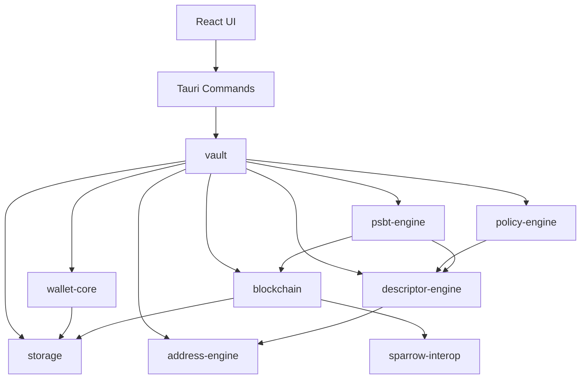
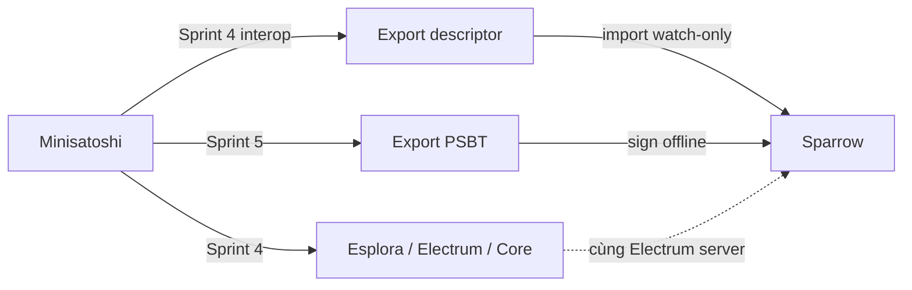

# Kế hoạch phát triển Minisatoshi — Bitcoin Vault Engine

> Ứng dụng desktop offline-first, mã nguồn mở, tập trung vào một việc: **tạo và quản lý Bitcoin vault bằng Miniscript**.
> Không server, không cloud, không tài khoản. Fund management (Giai đoạn 5) chỉ xuất hiện khi MVP ổn định.

---

## Mục lục

1. [Nguyên tắc kiến trúc](#nguyên-tắc-kiến-trúc)
2. [Tech stack](#tech-stack)
3. [Cấu trúc monorepo](#cấu-trúc-monorepo)
4. [Sơ đồ phụ thuộc module](#sơ-đồ-phụ-thuộc-module)
5. [Policy Engine tổng quát](#policy-engine-tổng-quát)
6. [Giai đoạn 1 — MVP (8 Sprint)](#giai-đoạn-1--mvp-8-sprint)
7. [Giai đoạn 2–5](#giai-đoạn-25-roadmap)
8. [Quyết định kỹ thuật](#quyết-định-kỹ-thuật)
9. [Test strategy](#test-strategy)
10. [Rủi ro và giảm thiểu](#rủi-ro-và-giảm-thiểu)

---

## Nguyên tắc kiến trúc

| Nguyên tắc | Ý nghĩa |
|---|---|
| **Rust-first** | Mọi logic Bitcoin/Miniscript nằm trong crates Rust |
| **UI không biết Miniscript** | React chỉ gửi policy JSON + xpub; engine compile descriptor |
| **Policy engine tổng quát** | Không hard-code A/B/C; mọi vault là một policy config |
| **Offline by default** | Blockchain sync là tùy chọn, không bắt buộc để tạo vault |
| **Descriptor là source of truth** | Vault = descriptor + metadata; có thể export/import |
| **Tương thích ví bên ngoài** | Sparrow không phải backend; interop qua descriptor + PSBT + cùng Electrum server |

---

## Tech stack

```text
Rust
Tauri 2
React
TypeScript
rust-bitcoin
rust-miniscript
bdk_wallet
bitcoincore-rpc
serde
SQLite
```

---

## Cấu trúc monorepo

```text
minisatoshi/
├── Cargo.toml                    # workspace root
├── apps/
│   └── desktop/                  # Tauri 2 app
│       ├── src-tauri/
│       └── src/                  # React + TypeScript
├── crates/
│   ├── wallet-core/              # wallet lifecycle
│   ├── policy-engine/            # JSON policy → Miniscript
│   ├── descriptor-engine/        # Miniscript → descriptor
│   ├── address-engine/           # derive receive/change
│   ├── psbt-engine/              # create/sign/combine/finalize
│   ├── blockchain/               # Esplora / Electrum / Core + Sparrow interop
│   ├── storage/                  # SQLite
│   └── vault/                    # orchestration layer
├── ui/                           # shared React components (optional)
├── tests/
│   ├── integration/
│   └── vectors/                  # known-good descriptors, PSBTs
└── docs/
    └── DEVELOPMENT_PLAN.md       # file này
```

**Thứ tự build bắt buộc:**

`storage` → `policy-engine` → `descriptor-engine` → `wallet-core` → `address-engine` → `blockchain` → `psbt-engine` → `vault` → `desktop UI`

---

## Sơ đồ phụ thuộc module



---

## Policy Engine tổng quát

Thay vì thiết kế riêng cho mô hình A/B/C, policy engine nhận cấu hình tổng quát. UI wizard A/B/C chỉ là **preset** map sang policy JSON.

### Schema policy (v1)

```json
{
  "version": 1,
  "network": "mainnet",
  "script_type": "taproot",
  "keys": [
    { "id": "A", "role": "investor", "xpub": "xpub6...", "fingerprint": "a1b2c3d4" },
    { "id": "B", "role": "manager",  "xpub": "xpub6...", "fingerprint": "e5f6g7h8" },
    { "id": "C", "role": "recovery", "xpub": "xpub6...", "fingerprint": "i9j0k1l2" }
  ],
  "policy": {
    "primary": "(A && B) || (A && C)",
    "fallback": {
      "after": "4y",
      "allow": "A"
    }
  }
}
```

### Pipeline biên dịch

```text
PolicyConfig (JSON)
    ↓ validate schema
Policy AST (internal)
    ↓ resolve keys → pk(K) fragments
Miniscript expression
    ↓ compile (rust-miniscript)
Descriptor (tr(...) hoặc wsh(...))
    ↓ checksum
Output descriptor string
```

### Policy DSL nội bộ

| Token | Miniscript |
|---|---|
| `A`, `B`, `C` | `pk(key_A)` |
| `&&` | `and_v` / `andor` (tùy context) |
| `\|\|` | `or_i` / `or_c` |
| `after: 4y` | `older(126144)` (blocks, configurable) |
| `thresh(k, ...)` | `thresh(k, ...)` |

### Preset templates (UI wizard)

UI wizard A/B/C map sang:

```json
{
  "primary": "(A && B) || (A && C)",
  "fallback": { "after": "4y", "allow": "A" }
}
```

Sau này thêm preset `2-of-3`, `3-of-5` mà không sửa engine.

---

## Giai đoạn 1 — MVP (8 Sprint)

Mỗi sprint = 1–2 session Cursor, có deliverable test được.

---

### Sprint 0 — Scaffold

**Mục tiêu:** Monorepo chạy được, CI cơ bản.

- [ ] Khởi tạo Cargo workspace
- [ ] Tauri 2 + React + TypeScript + Vite
- [ ] `rustfmt`, `clippy`, GitHub Actions (build + test)
- [ ] README cơ bản

**Deliverable:** `cargo test` pass, app mở được window trống.

---

### Sprint 1 — `policy-engine` + `descriptor-engine`

**Mục tiêu:** JSON → descriptor string, có unit test.

#### `policy-engine` API

```rust
pub struct PolicyConfig { /* serde */ }
pub fn validate(config: &PolicyConfig) -> Result<(), PolicyError>;
pub fn compile_miniscript(config: &PolicyConfig) -> Result<Miniscript<...>, PolicyError>;
```

#### `descriptor-engine` API

```rust
pub fn compile_descriptor(
    miniscript: Miniscript<...>,
    network: Network,
    script_type: ScriptType,  // Taproot default
) -> Result<String, DescriptorError>;

pub fn parse_descriptor(desc: &str) -> Result<Descriptor, DescriptorError>;
pub fn checksum(descriptor: &str) -> String;
```

#### Tests bắt buộc

- A/B/C preset → descriptor khớp vector đã biết
- `2-of-3` preset
- Timelock `4y` → `older(N)` đúng
- Invalid policy → error rõ ràng

**Deliverable:** `cargo test -p policy-engine` + `cargo test -p descriptor-engine` green.

---

### Sprint 2 — `storage` + `wallet-core`

#### SQLite schema v1

```sql
-- wallets
CREATE TABLE wallets (
    id          TEXT PRIMARY KEY,
    name        TEXT NOT NULL,
    network     TEXT NOT NULL,       -- mainnet | testnet | signet
    created_at  INTEGER NOT NULL,
    updated_at  INTEGER NOT NULL
);

-- vaults (1 wallet → nhiều vault)
CREATE TABLE vaults (
    id            TEXT PRIMARY KEY,
    wallet_id     TEXT NOT NULL REFERENCES wallets(id),
    name          TEXT NOT NULL,
    policy_json   TEXT NOT NULL,     -- PolicyConfig serialized
    descriptor    TEXT NOT NULL,
    script_type   TEXT NOT NULL,
    created_at    INTEGER NOT NULL
);

-- addresses
CREATE TABLE addresses (
    id          TEXT PRIMARY KEY,
    vault_id    TEXT NOT NULL REFERENCES vaults(id),
    address     TEXT NOT NULL,
    index       INTEGER NOT NULL,
    is_change   BOOLEAN NOT NULL,
    used        BOOLEAN DEFAULT FALSE,
    created_at  INTEGER NOT NULL
);

-- transactions (watch-only)
CREATE TABLE transactions (
    txid        TEXT NOT NULL,
    vault_id    TEXT NOT NULL REFERENCES vaults(id),
    block_height INTEGER,
    amount      INTEGER,             -- satoshis, signed
    fee         INTEGER,
    confirmed   BOOLEAN,
    raw_json    TEXT,                -- full tx metadata
    PRIMARY KEY (txid, vault_id)
);

-- labels
CREATE TABLE labels (
    id          TEXT PRIMARY KEY,
    target_type TEXT NOT NULL,       -- address | tx | vault
    target_id   TEXT NOT NULL,
    label       TEXT NOT NULL
);
```

#### `wallet-core` API

```rust
pub fn create_wallet(name: &str, network: Network) -> Result<Wallet, WalletError>;
pub fn open_wallet(id: &str) -> Result<Wallet, WalletError>;
pub fn list_wallets() -> Result<Vec<WalletSummary>, WalletError>;
pub fn backup_wallet(id: &str, path: &Path) -> Result<(), WalletError>;
pub fn restore_wallet(path: &Path) -> Result<Wallet, WalletError>;
pub fn import_descriptor(wallet_id: &str, descriptor: &str) -> Result<Vault, WalletError>;
pub fn export_descriptor(vault_id: &str) -> Result<String, WalletError>;
```

**Deliverable:** Tạo wallet, lưu/load từ SQLite, round-trip descriptor.

---

### Sprint 3 — `address-engine` + `vault`

#### `address-engine` API

```rust
pub fn new_receive_address(vault: &Vault, index: u32) -> Result<Address, AddressError>;
pub fn new_change_address(vault: &Vault, index: u32) -> Result<Address, AddressError>;
pub fn derive_address(descriptor: &str, index: u32, is_change: bool) -> Result<String, AddressError>;
```

#### `vault` API

```rust
pub fn create_vault(wallet_id: &str, name: &str, policy: PolicyConfig) -> Result<Vault, VaultError>;
pub fn list_vaults(wallet_id: &str) -> Result<Vec<VaultSummary>, VaultError>;
pub fn get_vault(vault_id: &str) -> Result<Vault, VaultError>;
pub fn vault_balance(vault_id: &str) -> Result<Balance, VaultError>;
pub fn vault_history(vault_id: &str) -> Result<Vec<TxSummary>, VaultError>;
```

**Deliverable:** Tạo vault từ policy JSON → nhận address Taproot đầu tiên. ✅

---

### Sprint 4 — `blockchain` + Sparrow interop

#### Trait chung

```rust
pub trait BlockchainBackend: Send + Sync {
    fn sync(&self, descriptor: &str, progress: impl Fn(SyncProgress)) -> Result<SyncResult, ChainError>;
    fn get_balance(&self, descriptor: &str) -> Result<Balance, ChainError>;
    fn get_history(&self, descriptor: &str) -> Result<Vec<TxSummary>, ChainError>;
    fn get_utxos(&self, descriptor: &str) -> Result<Vec<Utxo>, ChainError>;
    fn broadcast(&self, tx_hex: &str) -> Result<Txid, ChainError>;
}
```

#### Blockchain backends (theo thứ tự ưu tiên)

1. **Esplora** — dễ nhất, không cần node local
2. **Electrum** — phổ biến; **dùng chung server với Sparrow**
3. **Bitcoin Core RPC** — cho user chạy full node

> **Lưu ý:** Sparrow **không** implement `BlockchainBackend`. Sparrow là app ví desktop;
> nó kết nối *tới* Esplora/Electrum/Core chứ không expose API cho app khác query balance/UTXO.

#### Sparrow interop (`blockchain::sparrow`)

Module nhẹ, không phụ thuộc cài đặt Sparrow. Mục tiêu: workflow handoff file/string, offline-first.

```rust
/// Descriptor + metadata để user import watch-only wallet trong Sparrow.
pub struct SparrowWalletExport {
    pub name: String,
    pub descriptor: String,
    pub network: NetworkName,
    pub import_instructions: String,
}

pub fn export_watch_only_wallet(vault: &Vault) -> Result<SparrowWalletExport, SparrowError>;

/// Preset Electrum/Esplora URLs khớp network — cùng server Sparrow thường dùng.
pub fn default_server_presets(network: NetworkName) -> Vec<ServerPreset>;

pub struct ServerPreset {
    pub label: String,       // e.g. "Blockstream (SSL)"
    pub backend: BackendKind, // Esplora | Electrum | Core
    pub url: String,
}
```

**Sparrow ↔ Minisatoshi mapping**

| Tính năng | Minisatoshi | Sparrow |
|---|---|---|
| Sync balance/UTXO | `EsploraBackend` / `ElectrumBackend` / `CoreRpcBackend` | Cùng loại server, cùng network |
| Watch-only vault | Export descriptor từ vault | File → New Wallet → Import → Descriptor |
| Ký giao dịch | Export PSBT unsigned (Sprint 5) | File → Open Transaction → Sign |
| Broadcast | `BlockchainBackend::broadcast` | Sparrow broadcast qua server của nó |



#### Tests bắt buộc

- Esplora balance/history trên testnet/signet (mock HTTP hoặc integration nhẹ)
- Electrum client parse + query (mock server)
- `export_watch_only_wallet` → descriptor có checksum, đúng network
- `default_server_presets` trả preset hợp lệ cho từng network

**Deliverable:** Sync balance trên testnet/signet; export descriptor import được vào Sparrow watch-only. ✅

---

### Sprint 5 — `psbt-engine`

#### API

```rust
pub fn create_psbt(
    vault: &Vault,
    recipients: Vec<(Address, Amount)>,
    fee_rate: FeeRate,
    utxos: Vec<Utxo>,
) -> Result<Psbt, PsbtError>;

pub fn sign_psbt(psbt: &mut Psbt, signer: &dyn Signer) -> Result<SignProgress, PsbtError>;
pub fn combine_psbt(a: Psbt, b: Psbt) -> Result<Psbt, PsbtError>;
pub fn finalize(psbt: &mut Psbt) -> Result<Transaction, PsbtError>;
pub fn broadcast(psbt: &Psbt, backend: &dyn BlockchainBackend) -> Result<Txid, PsbtError>;
pub fn export_psbt(psbt: &Psbt, format: ExportFormat) -> Result<Vec<u8>, PsbtError>;
// ExportFormat: Base64 | File | QR-chunks
// Sparrow: import file .psbt hoặc paste base64 (BIP174 chuẩn, không custom format)
```

**Giai đoạn 1:** Sign bằng xprv/software key (dev/test). Ký qua Sparrow/hardware wallet → import PSBT đã ký. Hardware wallet trực tiếp → Giai đoạn 3.

#### Tests

- 2-of-2 PSBT create → sign → combine → finalize
- Timelock path: verify `nSequence` đúng
- PSBT export → Sparrow import round-trip (unsigned)

**Deliverable:** Tạo PSBT unsigned, export base64/file tương thích Sparrow; finalize với test keys. ✅

---

### Sprint 6 — Tauri commands + type bridge

#### Tauri commands (Rust → React)

```rust
#[tauri::command]
async fn create_vault_cmd(wallet_id: String, policy: PolicyConfig) -> Result<VaultDto, String>;

#[tauri::command]
async fn get_balance_cmd(vault_id: String) -> Result<BalanceDto, String>;

#[tauri::command]
async fn create_psbt_cmd(req: CreatePsbtRequest) -> Result<PsbtDto, String>;
```

**TypeScript types** generate từ `ts-rs` hoặc `specta` để đồng bộ Rust ↔ TS.

**Deliverable:** React gọi được `create_vault` qua Tauri IPC. ✅

---

### Sprint 7 — UI MVP

#### Pages

| Route | Nội dung |
|---|---|
| `/wallets` | Danh sách wallet, tạo mới |
| `/vaults` | Danh sách vault, dashboard |
| `/vaults/new` | Wizard 5 bước |
| `/vaults/:id` | Dashboard: balance, UTXO, policy, descriptor |
| `/vaults/:id/receive` | Address + QR + copy descriptor + **Export for Sparrow** |
| `/vaults/:id/send` | Wizard: address → amount → fee → PSBT export (Sparrow-compatible) |
| `/settings` | Network, blockchain backend, server URL, **Sparrow server presets** |

#### Sidebar

```text
Wallets
Vaults
Transactions
Settings
```

#### Create Vault Wizard

```text
Step 1: Investor XPUB  → validate fingerprint
Step 2: Manager XPUB
Step 3: Recovery XPUB
Step 4: Timelock (slider: 1–10 năm)
Step 5: Review policy JSON + Generate
```

#### Dashboard

Hiển thị: Balance, Recent TX, UTXO, Policy, Descriptor

#### Send flow

```text
Address → Amount → Fee → Create PSBT → Export (file / base64 → Sparrow)
```

**Deliverable:** End-to-end flow trên testnet: tạo vault → nhận address → tạo PSBT. ✅

---

### Sprint 8 — Test, hardening, release v0.1.0

- [x] Integration tests full flow (`crates/vault/tests/vault_lifecycle.rs`)
- [x] Test vectors cho Taproot descriptors (`tests/vectors/`)
- [x] Error messages thân thiện (không leak xprv) — `user_facing_error` + redact
- [x] App icon, version, release build (Windows + macOS + Linux) — branded icons + `release.yml`
- [x] `CHANGELOG.md`, `docs/policy-format.md`

**Deliverable:** Release v0.1.0 tooling sẵn sàng (tag `v0.1.0` → GitHub Release draft). ✅


---

## Giai đoạn 2–5 (roadmap)

### Giai đoạn 2 — Policy mở rộng

Sau khi MVP ổn định, thêm:

- Miniscript Builder GUI
- Nhiều policy templates
- Nhiều recovery path
- Nhiều manager
- Nhiều investor
- Inheritance
- Dead man's switch

**Phụ thuộc:** Policy engine v1 ổn định.

---

### Giai đoạn 3 — Hardware Wallet

- Ledger
- Trezor
- Coldcard
- Thêm vendors sau

**Phụ thuộc:** PSBT engine + HWI integration.

---

### Giai đoạn 4 — Import/Export

- Watch-only Wallet
- Descriptor Import
- Descriptor Export
- QR Descriptor
- **Sparrow workflow docs** (import descriptor, sign PSBT, recommended servers)

**Phụ thuộc:** Descriptor engine + PSBT engine.

---

### Giai đoạn 5 — Fund Management

Lúc này mới thêm server:

- KYC
- Investor management
- NAV
- Reporting
- API
- Database

**Nguyên tắc:** Không đụng vào private key. Chỉ watch-only descriptors.

---

## Quyết định kỹ thuật

| Câu hỏi | Đề xuất |
|---|---|
| Script type mặc định? | **Taproot** (`tr`) — hiện đại, phí thấp |
| Network mặc định dev? | **Signet** hoặc **testnet** |
| Key derivation? | BIP86 (Taproot), BIP84 fallback nếu cần |
| Timelock unit? | Blocks (chuẩn Miniscript `older`); UI hiển thị năm, convert `years × 52560` blocks |
| BDK version? | `bdk_wallet 1.x` (tách từ bdk-ng) |
| DB encryption? | Giai đoạn 1: không mã hóa (watch-only). Giai đoạn 3+: SQLCipher nếu lưu xprv |
| Sparrow integration? | **Interop, không phải backend** — descriptor export (Sprint 4), PSBT BIP174 (Sprint 5), Electrum server presets |

---

## Test strategy

```text
tests/
├── vectors/
│   ├── policy_abc_mainnet.json
│   ├── policy_abc_expected_descriptor.txt
│   └── psbt_2of3_unsigned.base64
├── unit/
│   ├── policy_compile_test.rs
│   ├── descriptor_roundtrip_test.rs
│   ├── address_derivation_test.rs
│   └── psbt_finalize_test.rs
└── integration/
    └── vault_lifecycle_test.rs   # create → address → psbt → export
```

**Coverage tối thiểu Giai đoạn 1:**

- Policy compile
- Descriptor roundtrip
- Address derivation Taproot
- PSBT create/export

---

## Rủi ro và giảm thiểu

| Rủi ro | Giảm thiểu |
|---|---|
| Miniscript compile fail với policy phức tạp | Validate AST trước khi compile; test matrix đủ lớn |
| `bdk_wallet` API thay đổi | Pin version; abstract qua trait trong `blockchain` |
| Timelock sai số blocks | Document rõ; dùng constant `BLOCKS_PER_YEAR = 52560` |
| User nhập xpub sai network | Validate version bytes (xpub/tpub) + fingerprint |
| PSBT multi-signer phức tạp | Giai đoạn 1 chỉ export unsigned PSBT; sign offline (Sparrow / HW) |
| Nhầm Sparrow là blockchain backend | Document rõ trong plan; chỉ dùng Electrum/Esplora/Core cho sync |

---

## Session Cursor tiếp theo

```
Post-v0.1: Giai đoạn 2 — Policy mở rộng / Miniscript Builder GUI
  hoặc Giai đoạn 3 — Hardware wallet signing
```

Pipeline hiện tại: `Policy → Descriptor → Address → Balance → PSBT → Tauri IPC → UI MVP` ✅ (Sprint 1–8).
v0.1.0 hardening xong; bước kế: mở rộng policy hoặc HW signing.


---

## Luồng dữ liệu tổng thể

```text
Wallet
  ↓
Descriptor
  ↓
Addresses
  ↓
UTXO
  ↓
PSBT
  ↓
Broadcast
```
